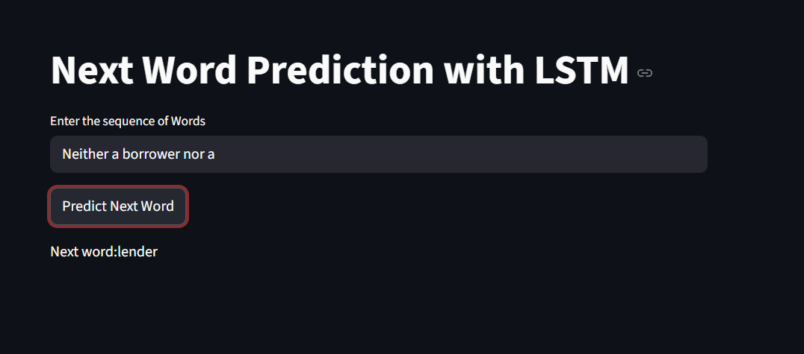

# LSTM-RNN

📌 Project Overview
The goal of this project is to build a language model that understands the stylistic patterns and vocabulary of Shakespearean English. By leveraging the sequential memory capabilities of LSTMs, the model can predict contextual next words for famous quotes and general phrases.

🛠️ Technical Stack
Deep Learning Framework: TensorFlow / Keras

Architecture: Sequential LSTM with Embedding and Dropout layers

Frontend: Streamlit

Data Source: NLTK Gutenberg Corpus (Shakespeare's Hamlet)

Languages: Python (NumPy, Pandas, Scikit-learn)

📊 Model Architecture & Training
The model was built with a focused architecture to balance performance and training time:

Embedding Layer: Converts word indices into dense vectors of 100 dimensions.

LSTM Layers: Two stacked LSTM layers (150 and 100 units) to capture deep temporal dependencies.

Regularization: Dropout layer (0.2) to prevent overfitting.

Output Layer: Dense layer with Softmax activation for multi-class classification across the 4,818-word vocabulary.

Performance: The model achieved approximately 66.84% training accuracy over 100 epochs.

  

## 🚀 Deployment
The application is live and can be accessed here:  
🔗 **[Live Demo: Next Word Prediction with LSTM](https://lstm-rnn-project.streamlit.app/)**
